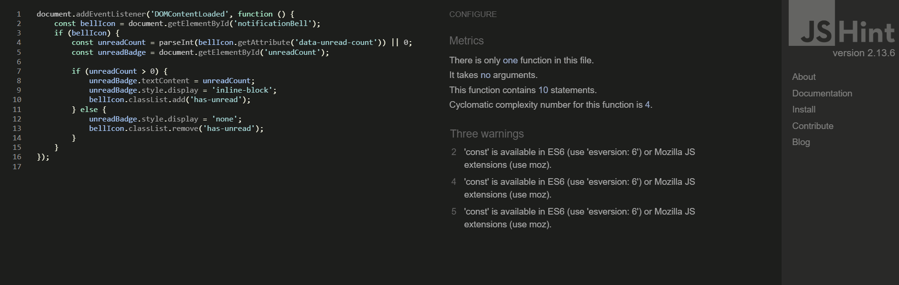

# Harmonia Sinfonia: Testing Documentation

Return back to the [README.md](README.md) file.

## Table of Contents

1. [Introduction](#introduction)
2. [Validator Testing](#validator-testing)
   - [HTML](#html)
   - [CSS](#css)
   - [JavaScript](#javascript)
   - [Python](#python)
3. [Lighthouse Testing](#lighthouse-testing)
4. [Manual Testing](#manual-testing)
5. [User Stories Completion](#user-stories-completion)
6. [Automated Testing](#automated-testing)
7. [Browser Compatibility](#browser-compatibility)
8. [Responsiveness](#responsiveness)
9. [Bugs](#bugs)
   - [Resolved Bugs](#resolved-bugs)
   - [Remaining Bugs](#remaining-bugs)

## Introduction

This document outlines the comprehensive testing approach and results for Harmonia Sinfonia. The purpose of this testing file is to ensure that all functionalities of the platform operate correctly and efficiently, providing an optimal user experience. The testing covers various aspects, including validation of code, performance, security, usability, and compatibility across different browsers and devices.

### Testing Strategy

The testing approach includes both manual and automated testing procedures. The key components of the strategy are:

- **Validator Testing**: Ensuring that the HTML, CSS, JavaScript, and Python code conform to the respective standards and best practices.
- **Lighthouse Testing**: Utilising Lighthouse to audit the performance, accessibility, SEO, and best practices of the web pages.
- **Manual Testing**: Conducting detailed manual tests to validate the functionality and user experience across different scenarios.
- **Automated Testing**: Implementing automated tests to regularly check the integrity of the application's functionalities.
- **Browser Compatibility**: Testing the application on multiple browsers to ensure consistent behaviour and appearance.
- **Responsiveness**: Verifying that the application is fully responsive and works well on various devices, including desktops, tablets, and mobile phones.
- **Bugs**: Tracking and resolving bugs to improve the stability and reliability of the platform.

This structured approach was designed so that Harmonia Sinfonia meets the highest standards of quality, performance, and user satisfaction.

## Validator Testing

### HTML

I have used the recommended HTML W3C Validator to validate all of my HTML files.

Since my project uses Django templates, such as , , and {{ variable|filter }}, it cannot be directly validated. Instead, I followed these steps to validate my HTML:

1. Render the Page in the Browser: Load the Django page in a browser.
2. View Source and Copy HTML: Right-click on the page and select "View Page Source" (or use a similar command) to see the rendered HTML. Copy this HTML content.
3. Validate the Copied HTML: Go to the Nu Html Checker (or any other HTML validator), paste the copied HTML into the "Validate by Input" section, and run the validation.

This ensured the HTML generated by my Django templates was correctly validated.

| Page             | Screenshot                                     | Notes               |
|------------------|------------------------------------------------|---------------------|
| Home             |  | Pass: No Errors     |
| Learn More       |  | Pass: No Errors     |
| Sign Up          |  | Fail: Three Errors  |
| Sign Up          |  | Pass: No Errors     |
| Sign In          |  | Pass: No Errors     |
| Events List      |  | Pass: No Errors     |
| Events Detail    |  | Pass: No Errors     |
| Post List        |  | Fail: Four Errors   |
| Post List        |  | Pass: No Errors     |
| Post Detail      |  | Pass: No Errors     |
| Create New Post  |  | Pass: No Errors     |
| Edit Post        |  | Pass: No Errors     |
| Flag Post        |  | Pass: No Errors     |
| Flag Comment     |  | Fail: One Error     |
| Flag Comment     |  | Pass: No Errors     |
| Profile Detail   |  | Pass: No Errors     |
| Edit Profile     |  | Pass: No Errors     |
| Following List   |  | Pass: No Errors     |
| Notifications List |  | Pass: No Errors     |
| Profile List     |  | Pass: No Errors     |
| Search Results   |  | Pass: No Errors     |

### CSS

## CSS

I validated my CSS file using the recommended CSS Jigsaw Validator. 

### Validation Results

| File       | Result | Issue                            | Screenshot                                      | Notes                        |
|------------|--------|----------------------------------|------------------------------------------------|------------------------------|
| style.css  | Pass   | Not applicable    |  | No issues  |

### JavaScript

 was used to validate the JS.

| File       | Result | Issue                            | Screenshot                                      | Notes                        |
|------------|--------|----------------------------------|------------------------------------------------|------------------------------|
| index.js  | Pass   | Not applicable    |  | No issues  |

### Python

I used [CI Python Linter](https://pep8ci.herokuapp.com/) and built-in VSCode extensions (Flake8 and autopep8) to validate the Python files. The initial linting brought up several errors, which were primarily related to blank spaces and line spacing issues.

After resolving these initial issues, the remaining problems were mostly related to line length, which are advisory and do not necessarily impact functionality.

Given that these line length issues are advisory, I did not refactor all instances where the code exceeded the recommended length. To avoid an excessive number of screenshots for each Python file, I have provided a summary screenshot from the 'Problems' tab within VSCode showing the remaining issues.

