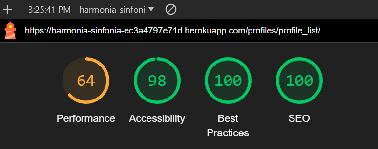
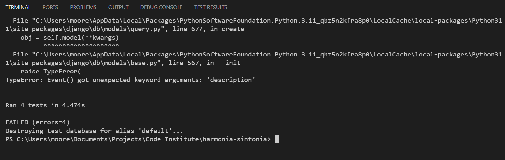

# Harmonia Sinfonia: Testing Documentation

Return back to the [README.md](README.md) file.

## Table of Contents

1. [Introduction](#introduction)
2. [Validator Testing](#validator-testing)
   - [HTML](#html)
   - [CSS](#css)
   - [JavaScript](#javascript)
   - [Python](#python)
3. [Lighthouse Testing](#lighthouse-testing)
4. [Manual Testing](#manual-testing)
    - [User Story Testing](#user-story-testing)
    - [Defensive Testing](#defensive-testing)
6. [Automated Testing](#automated-testing)
7. [Browser Compatibility](#browser-compatibility)
8. [Responsiveness](#responsiveness)
9. [Bugs](#bugs)
   - [Resolved Bugs](#resolved-bugs)
   - [Remaining Bugs](#remaining-bugs)

## Introduction

This document outlines the comprehensive testing approach and results for Harmonia Sinfonia. The purpose of this testing file is to ensure that all functionalities of the platform operate correctly and efficiently, providing an optimal user experience. The testing covers various aspects, including validation of code, performance, security, usability, and compatibility across different browsers and devices.

### Testing Strategy

The testing approach includes both manual and automated testing procedures. The key components of the strategy are:

- **Validator Testing**: Ensuring that the HTML, CSS, JavaScript, and Python code conform to the respective standards and best practices.
- **Lighthouse Testing**: Utilising Lighthouse to audit the performance, accessibility, SEO, and best practices of the web pages.
- **Manual Testing**: Conducting detailed manual tests to validate the functionality and user experience across different scenarios.
- **Automated Testing**: Implementing automated tests to regularly check the integrity of the application's functionalities.
- **Browser Compatibility**: Testing the application on multiple browsers to ensure consistent behaviour and appearance.
- **Responsiveness**: Verifying that the application is fully responsive and works well on various devices, including desktops, tablets, and mobile phones.
- **Bugs**: Tracking and resolving bugs to improve the stability and reliability of the platform.

This structured approach was designed so that Harmonia Sinfonia meets the highest standards of quality, performance, and user satisfaction.

## Validator Testing

### HTML

I have used the recommended HTML W3C Validator to validate all of my HTML files.

Since my project uses Django templates, such as , , and {{ variable|filter }}, it cannot be directly validated. Instead, I followed these steps to validate my HTML:

1. Render the Page in the Browser: Load the Django page in a browser.
2. View Source and Copy HTML: Right-click on the page and select "View Page Source" (or use a similar command) to see the rendered HTML. Copy this HTML content.
3. Validate the Copied HTML: Go to the Nu Html Checker (or any other HTML validator), paste the copied HTML into the "Validate by Input" section, and run the validation.

This ensured the HTML generated by my Django templates was correctly validated.

| Page             | Screenshot                                     | Notes               |
|------------------|------------------------------------------------|---------------------|
| Home             |  | Pass: No Errors     |
| Learn More       |  | Pass: No Errors     |
| Sign Up          |  | Fail: Three Errors  |
| Sign Up          |  | Pass: No Errors     |
| Log In          |  | Pass: No Errors     |
| Events List      |  | Pass: No Errors     |
| Events Detail    |  | Pass: No Errors     |
| Post List        |  | Fail: Four Errors   |
| Post List        |  | Pass: No Errors     |
| Post Detail      |  | Pass: No Errors     |
| Create New Post  |  | Pass: No Errors     |
| Edit Post        |  | Pass: No Errors     |
| Flag Post        |  | Pass: No Errors     |
| Flag Comment     |  | Fail: One Error     |
| Flag Comment     |  | Pass: No Errors     |
| Profile Detail   |  | Pass: No Errors     |
| Edit Profile     |  | Pass: No Errors     |
| Following List   |  | Pass: No Errors     |
| Notifications List |  | Pass: No Errors     |
| Profile List     |  | Pass: No Errors     |
| Search Results   |  | Pass: No Errors     |

### CSS

I validated my CSS file using the recommended CSS Jigsaw Validator.

| File       | Result | Issue                        | Screenshot                                      | Notes                        |
|------------|--------|------------------------------|------------------------------------------------|------------------------------|
| style.css  | Pass   | None                         |  | No issues                    |

### JavaScript

I have used the recommended [JShint Validator](https://jshint.com) to validate all of my JavaScript files.

| File       | Result | Issue                        | Screenshot                                      | Notes                        |
|------------|--------|------------------------------|------------------------------------------------|------------------------------|
| index.js   | Pass   | None                         |  | No issues                    |

### Python

I have used [CI Python Linter](https://pep8ci.herokuapp.com) and built-in VSCode extensions (Flake8 and autopep8) to validate the Python files. The initial linting brought up several errors, which were primarily related to blank spaces and line spacing issues.

| File               | Result | Screenshot                                      | Notes                                      |
|--------------------|--------|------------------------------------------------|--------------------------------------------|
| Various (initial)  | Fail   |  | Issues with blank spaces and line spacing  |
| Various (improved) | Pass   |  | Remaining issues related to line length    |

After resolving these initial issues, the remaining problems were mostly related to line length, which are advisory and do not necessarily impact functionality.

## Lighthouse Testing

I used Google Chrome's Lighthouse tool to perform audits on performance, accessibility, SEO, and best practices.

| Page             | Desktop Screenshot                                  | Mobile Screenshot                                  | Notes               |
|------------------|-----------------------------------------------------|---------------------------------------------------|---------------------|
| Home             |  |  | Mobile Performance Issue   |
| Learn More       |  |  | No major issues     |
| Sign Up          |  |  | No major issues   |
| Log In          |  |  | No major issues   |
| Events List      |  |  | Performance Issues     |
| Events Detail    |  |  | No major issues     |
| Post List        |  |  | No major issues   |
| Post Detail      |  |  | No major issues     |
| Create New Post  |  |  | No major issues     |
| Edit Post        |  |  | No major issues     |
| Flag Post        |  |  | No major issues     |
| Flag Comment     |  |  | No major issues   |
| Profile Detail   |  |  | Mobile Performance Issue     |
| Edit Profile     |  |  | No major issues     |
| Following List   |  |  | No major issues     |
| Notifications List |  |  | No major issues     |
| Profile List     |  |  | Mobile Performance Issue    |
| Search Results   |  |  | No major issues     |

## Manual Testing

### User Story Testing

The following table provides a detailed overview of the testing performed for each user story to ensure that the platform meets all requirements and provides a seamless user experience.

### New Visitors (EPIC A)

| User Story | Test Scenario | Expected Outcome | Pass/Fail | Comments |
| --- | --- | --- | --- | --- |
| As a new visitor, I can sign up so that I can join the platform and become a registered member. | Sign up with valid details | User is registered and redirected to home page |  | |
| As a new site user, I would like to clearly see the site's purpose, so that I can decide whether or not to sign up. | Visit homepage and read about the platform | Clear information about the platform's purpose is displayed |  | |

### Registered Users (EPIC B)

| User Story | Test Scenario | Expected Outcome | Pass/Fail | Comments |
| --- | --- | --- | --- | --- |
| As a registered user, I can log in so that I can access my account and interact with the platform. | Log in with valid credentials | User is logged in and redirected to their feed |  | |
| As a registered user, I can view posts so that I can see content shared by other orchestra members. | Navigate to feed | Posts from followed members are displayed |  | |
| As a registered user, I can create new posts so that I can share my own content with the orchestra community. | Create a new post with text and image | Post is created and displayed in the feed |  | |
| As a registered user, I can delete my own posts so that I can remove content I no longer want to share. | Delete a post created by the user | Post is removed from the feed |  | |
| As a registered user, I can like posts so that I can express appreciation for content shared by others. | Like a post | Like count increases and like icon changes color |  | |
| As a registered user, I can comment on posts so that I can engage in discussions with other members. | Comment on a post | Comment is added and displayed under the post |  | |
| As a registered user, I can delete my own comments so that I can remove comments I no longer want to share. | Delete a comment made by the user | Comment is removed from the post |  | |
| As a registered user, I can follow/unfollow members so that I can customise my feed and stay updated on specific members. | Follow/unfollow a member | Follow/unfollow action is successful, and feed updates accordingly |  | |
| As a registered user, I can view the timestamp of posts so that I can see when the posts were made for context. | View a post's timestamp | Timestamp is displayed with the post |  | |
| As a registered user, I can receive notifications so that I can stay updated on interactions with my content. | Like a post/comment, receive a message | Notifications are received and displayed |  | |
| As a registered user, I can search for posts and members so that I can quickly find specific content or users. | Use search function | Relevant posts and members are displayed in search results |  | |
| As a registered user, I can edit my profile so that I can update my personal information and preferences. | Edit profile information | Profile is updated with new information |  | |
| As a registered user, I can like comments so that I can show appreciation for other members' comments. | Like a comment | Like count increases and like icon changes color |  | |
| As a registered user, I can expand posts so that I can see the full content of a post without leaving the feed. | Expand a post | Full content of the post is displayed |  | |
| As a registered user, I can send private messages so that I can communicate privately with other members. | Send a private message | Message is sent and displayed in the recipient's inbox |  | |
| As a registered user, I can report or flag inappropriate content so that it can be reviewed by admins for action. | Report a post/comment | Content is flagged and added to admin review |  | |

### Admin Users (EPIC C)

| User Story | Test Scenario | Expected Outcome | Pass/Fail | Comments |
| --- | --- | --- | --- | --- |
| As an admin, I can delete posts and comments so that I can remove inappropriate or violating content from the platform. | Delete a flagged post/comment | Post/comment is removed from the platform |  | |
| As an admin, I can review flagged content so that I can manage and moderate reported content effectively. | Review flagged posts/comments | Admin can view and take action on flagged content |  | |
| As an admin, I can unflag content so that I can dismiss flags for content that does not violate guidelines. | Unflag a post/comment | Content is unflagged and removed from the flagged list |  | |
| As an admin, I can suspend user accounts so that I can temporarily block members who repeatedly violate guidelines. | Suspend a user account | User account is suspended and unable to log in |  | |
| As an admin, I can use content moderation tools so that I can manage and filter content effectively on the platform. | Use content moderation tools | Tools function as expected and assist in content management |  | |

This comprehensive testing ensures that all user stories are fully implemented and functioning correctly, providing a robust and user-friendly platform for all members of Harmonia Sinfonia.

## Defensive Testing

This document outlines the defensive programming tests conducted for the project. The tests are designed to ensure that the application handles edge cases and provides appropriate feedback to the user.

### Home Page

| User Action         | Expected Result            | Pass/Fail | Comments |
|---------------------|----------------------------|-----------|----------|
| Click on Logo       | Redirect to Home page      |           |          |
| Invalid URL Access  | Show 404 error page        |           |          |

### Sign Up

| User Action                                     | Expected Result                           | Pass/Fail | Comments |
|-------------------------------------------------|-------------------------------------------|-----------|----------|
| Click on Sign Up button on home page            | Redirect to Sign Up page                  |           |          |
| Enter invalid email address                     | Field validation error                    |           |          |
| Enter mismatched passwords                      | Field validation error                    |           |          |
| Enter valid email and passwords                 | Redirect to feed page                     |           |          |
| Submit form without entering any data           | Field validation errors                   |           |          |

### Log In

| User Action                 | Expected Result                            | Pass/Fail | Comments |
|-----------------------------|--------------------------------------------|-----------|----------|
| Click on the Login button on home page | Redirect to Login page |           | |
| Enter invalid email address | Field validation error |           | |
| Enter invalid password | Field validation error |           | |
| Enter valid credentials | Redirect to feed page |           | |
| Click Forgot Password | Redirect to password reset page |           | |

### Log Out

| User Action                  | Expected Result                                       | Pass/Fail | Comments |
|------------------------------|-------------------------------------------------------|-----------|----------|
| Click Logout button          | Confirm logout prompt                                 |           |          |
| Click Confirm Logout button  | Redirect to home page                                 |           |          |

### Profile

| User Action                  | Expected Result                                       | Pass/Fail | Comments |
|------------------------------|-------------------------------------------------------|-----------|----------|
| Click on Profile button in nav | Redirect to Profile page                            |           |          |
| Click on the Edit icon       | Redirect to edit profile page                         |           |          |
| Click on the Back To Feed button | Redirect to feed page                            |           |          |
| Click on followers           | Redirect to followers list page                       |           |          |
| Click on a post              | Redirect to the individual post page                  |           |          |
| Click delete icon on own post | Redirect to post delete confirmation page           |           |          |
| Submit post form without content | Prompt to enter content                          |           |          |
| Brute force URL to edit another user's profile | Error message                     |           |          |

### Follow/Unfollow

| User Action                  | Expected Result                                       | Pass/Fail | Comments |
|------------------------------|-------------------------------------------------------|-----------|----------|
| Click on follow button       | Follow user, button changes to unfollow               |           | Notification to profile owner |
| Click on unfollow button     | Unfollow user, button changes to follow               |           |          |

### Post Interaction

| User Action                  | Expected Result                                       | Pass/Fail | Comments |
|------------------------------|-------------------------------------------------------|-----------|----------|
| Click on a post              | Redirect to the individual post page                  |           |          |
| Click the like button on a post | Like the post, increase like count                 |           | Notification to post author |
| Click the like button on a liked post | Unlike the post, decrease like count        |           |          |
| Click flag button            | Show message, flag post for review                    |           | Post added to admin review list |
| Submit post form without content | Prompt to enter content                          |           |          |
| Brute force URL to delete another user's post | Error message                     |           |          |

### Comment Interaction

| User Action                  | Expected Result                                       | Pass/Fail | Comments |
|------------------------------|-------------------------------------------------------|-----------|----------|
| Type text into comment form and click send | Create comment under post               |           | Notification to post author |
| Click like button on a comment | Like the comment, increase like count               |           | Notification to comment author |
| Click like button on a liked comment | Unlike the comment, decrease like count   |           |          |
| Click delete icon on own comment | Redirect to comment delete confirmation page  |           |          |
| Brute force URL to delete another user's comment | Error message               |           |          |
| Click edit icon on own comment | Redirect to comment edit page                     |           |          |
| Brute force URL to edit another user's comment | Error message                    |           |          |

### Search

| User Action                  | Expected Result                                       | Pass/Fail | Comments |
|------------------------------|-------------------------------------------------------|-----------|----------|
| Type text into search form and click search icon | Show results for users and posts       |           |          |
| Click on a user's name in search results | Redirect to user's profile                  |           |          |

### Notifications

| User Action                  | Expected Result                                       | Pass/Fail | Comments |
|------------------------------|-------------------------------------------------------|-----------|----------|
| Click on Notifications button when no notifications | No action                        |           |          |
| Click on Notifications button when there are notifications | Show notifications dropdown |           |          |
| Click on notification item   | Redirect to relevant page, remove notification from list |           |          |

### Admin Panel

| User Action                  | Expected Result                                       | Pass/Fail | Comments |
|------------------------------|-------------------------------------------------------|-----------|----------|
| Click on Admin Panel button in nav | Redirect to Admin Panel page with flagged posts list |           | Button only visible to admins |
| Brute force URL to access Admin Panel as a regular user | Error message              |           |          |
| Click delete icon on post in admin panel | Redirect to post delete confirmation page   |           |          |
| Click flag button on flagged post | Unflag post, remove from admin panel               |           |          |
| Click on user's name on flagged post | Redirect to user's profile                   |           |          |

### Events

| User Action                  | Expected Result                                       | Pass/Fail | Comments |
|------------------------------|-------------------------------------------------------|-----------|----------|
| Click on Events link in nav  | Redirect to Events page                               |           |          |
| Click on an event            | Redirect to event detail page                         |           |          |
| Click like button on an event | Like the event, increase like count                 |           | Notification to event author |
| Click like button on a liked event | Unlike the event, decrease like count         |           |          |

### General Error Handling

| User Action                  | Expected Result                                       | Pass/Fail | Comments |
|------------------------------|-------------------------------------------------------|-----------|----------|
| Access non-existent page     | Show 404 error page                                   |           |          |
| Access forbidden page        | Show 403 error page                                   |           |          |
| Access internal error page   | Show 500 error page                                   |           |          |

This comprehensive defensive programming test plan ensures that the Harmonia Sinfonia project handles edge cases effectively and provides appropriate feedback to the user, enhancing the overall user experience and maintaining application stability.


## Automated Testing

Automated testing is a crucial part of ensuring the stability and reliability of the Harmonia Sinfonia platform. This section outlines the automated tests implemented for various parts of the application, along with the results.

### Automated Test Implementation

I used Django's built-in testing framework to create automated tests for our application. Below are the key components tested:

1. **Profiles App**
2. **Posts App**
3. **Events App**
4. **Home App**
5. **Authentication App**

Each app's testing includes views, models, and forms to ensure all functionalities work as expected.

### Running the Tests

To run the tests, use the following command in the terminal:

```sh
python3 manage.py test
```

### Test Results

| App            | Test Result | Screenshot | Comments |
|----------------|-------------|------------|----------|
| Profiles       | Failed      |           | Some tests failed, highlighting issues in the user profiles functionalities. |
| Profiles       | Passed      |           | All tests passed successfully, ensuring that the profile-related functionalities are working correctly. |
| Posts         | Passed      |            | All tests passed successfully, ensuring that the post-related functionalities are working correctly. |
| Events         | Failed     |            | Some tests failed, due to issues in the URL patterns initially. |
| Events         | Passed      |            | All tests passed successfully, ensuring that the post-related functionalities are working correctly. |
| Home         | Failed     |            | Some tests failed, due to issues in the URL patterns initially. |
| Home         | Passed      |            | All tests passed successfully, ensuring that the post-related functionalities are working correctly. |
| Authentication | Passed      |            | All tests passed successfully, confirming that the authentication functionalities are working correctly. |

## Browser Compatibility

| Browser                  | Screenshot                                        | Comments |
|------------------------------|-------------------------------------------------------|-----------|
| Mobile (iPhone 12 Pro) |        |  390 x 844 - Pass        |
| Tablet (iPad Pro) |      |  1024 x 1366 - Pass      |
| Desktop |      |  1280 x 1024 - Pass      |
| Larger screen (4K) |     |  1920 X 1080 - Pass      |

## Responsiveness

The site was tested at various resolutions on differing devices. Examples of this can be found below utilising DevTools:

| Device                  | Screenshot                                        | Resolution |
|------------------------------|-------------------------------------------------------|-----------|
| Brave |        |  Works well         |
| Chrome |      |  Looks fine      |
| Firefox |      |  All fine      |
| Edge |     |  Runs well      |

## Bugs

### Resolved Bugs

During the development of this project, all encountered bugs were resolved and documented through git commit messages labeled as 'FIX'. Although an alternative approach could have been to raise issues through GitHub, I opted to track bugs within the git commit history to maintain a streamlined project management process:


### Unresolved Bugs

- Bell icon in notifications dropdown does not change colour based on whether there is an unread notification of not.
